# 🏗️ Home-Manager Configuration Architecture

This document describes the modular architecture of our cross-platform Home-Manager configuration, featuring automatic username detection and complete portability.

## 🎯 System Overview

## 🔄 Configuration Flow

```mermaid
flowchart TD
    start(["`👤 **User Command**
    home-manager switch --flake . --impure`"])

    subgraph detect["`🔍 **Username Detection**`"]
        env{"`**Environment Check**
        USER variable available?`"}
        auto["`**Auto-Detection**
        builtins.getEnv 'USER'`"]
        error["`❌ **Error**
        Helpful message + --impure hint`"]
    end

    subgraph eval["`📋 **Configuration Evaluation**`"]
        flake_eval["`**Flake Processing**
        System architecture detection
        Module selection`"]
        module_eval["`**Module Evaluation**
        Import and merge configs
        Package selection`"]
    end

    subgraph build["`🔨 **Build Process**`"]
        packages["`**Package Building**
        Nix store preparation
        Dependency resolution`"]
        configs["`**Configuration Generation**
        Template processing
        File creation`"]
    end

    subgraph deploy["`🚀 **Deployment**`"]
        symlinks["`**Symlink Creation**
        ~/.config/ structure
        Application configs`"]
        activation["`**System Activation**
        Service registration
        Permission fixes`"]
    end

    complete(["`✅ **Completion**
    Ready to use!`"])

    start --> detect
    env --> |Yes| auto
    env --> |No| error
    auto --> eval
    error --> complete
    eval --> flake_eval
    flake_eval --> module_eval
    module_eval --> build
    build --> packages
    packages --> configs
    configs --> deploy
    deploy --> symlinks
    symlinks --> activation
    activation --> complete

    style start fill:#e1f5fe
    style complete fill:#c8e6c9
    style error fill:#ffcdd2
    style auto fill:#fff3e0
```

## 📁 Module Architecture

```mermaid
graph LR
    subgraph "🎯 Entry Points"
        flake["`**flake.nix**
        • Multi-architecture
        • Auto username detection
        • Empty commonArgs`"]
        base["`**base.nix**
        • Cross-platform
        • Core modules
        • Universal settings`"]
        mac["`**mac.nix**
        • macOS-specific
        • Platform features`"]
    end

    subgraph "🔧 Core Infrastructure"
        packages["`**packages.nix**
        • 140+ tools
        • Categorized by function
        • Development stack`"]
        security["`**security.nix**
        • GPG hardening
        • SSH configuration
        • Encryption policies`"]
        git["`**git.nix**
        • Manual config required
        • Advanced features
        • Global gitignore`"]
    end

    subgraph "💻 Development Environment"
        helix["`**helix.nix**
        • LSP configuration
        • Multi-language support
        • Editor optimizations`"]
        k8s["`**kubernetes.nix**
        • Kubectl plugins
        • Cluster management
        • DevOps tools`"]
    end

    subgraph "🐚 Shell Experience"
        zsh["`**zsh.nix**
        • 60+ aliases
        • Functions & completions
        • History management`"]
        starship["`**starship.nix**
        • Custom prompt
        • Git integration
        • Context awareness`"]
    end

    subgraph "🎨 User Interface"
        ghostty["`**ghostty.nix**
        • Terminal theming
        • Font configuration
        • Key bindings`"]
    end

    flake --> base
    flake --> mac
    base --> packages
    base --> security
    base --> git
    base --> helix
    base --> k8s
    base --> zsh
    base --> starship
    base --> ghostty

    packages -.-> security
    security -.-> git
    zsh -.-> starship
```

## 🏗️ System Architecture Layers

```mermaid
graph TB
    subgraph L4["`🎨 **Layer 4: User Applications**`"]
        apps["`VS Code • Helix • Ghostty • Browsers • Git`"]
    end

    subgraph L3["`🐚 **Layer 3: Shell Environment**`"]
        shell["`Zsh • Starship • Aliases • Functions • Completions`"]
    end

    subgraph L2["`🛡️ **Layer 2: Security & Development**`"]
        security["`GPG • SSH • Direnv • Git Config • K8s Tools`"]
    end

    subgraph L1["`📦 **Layer 1: Package Management**`"]
        packages["`140+ Tools • Development Stack • System Utilities`"]
    end

    subgraph L0["`🔧 **Layer 0: Foundation**`"]
        foundation["`Nix • Home-Manager • Auto Username Detection`"]
    end

    L4 --> L3
    L3 --> L2
    L2 --> L1
    L1 --> L0
```

## 🔀 Configuration Variants

```mermaid
graph LR
    subgraph platforms["`🌐 **Platform Support**`"]
        direction TB
        arm_mac["`**Apple Silicon**
        aarch64-darwin
        .#mac / .#base`"]
        intel_mac["`**Intel Mac**
        x86_64-darwin
        .#mac-intel / .#base-intel`"]
        linux_x64["`**Linux x64**
        x86_64-linux
        .#base-linux`"]
        linux_arm["`**Linux ARM**
        aarch64-linux
        .#base-linux-arm`"]
    end

    subgraph configs["`⚙️ **Configuration Types**`"]
        direction TB
        base_config["`**Base Config**
        • Core modules only
        • Cross-platform
        • Minimal setup`"]
        mac_config["`**Mac Config**
        • macOS optimized
        • Full features`"]
    end

    subgraph auto["`🤖 **Auto-Detection**`"]
        direction TB
        user_detect["`**Username Detection**
        builtins.getEnv 'USER'
        Fallback with helpful error`"]
        sys_detect["`**System Detection**
        pkgs.stdenv.isDarwin
        Path adaptation`"]
    end

    platforms --> configs
    configs --> auto
```

## 🎛️ Module Dependencies

## 🚀 User Journey

## 📊 Key Metrics & Benefits

## 🔧 Architecture Benefits

### ✨ **Modularity**

- **Focused Modules**: Each module handles a specific domain
- **Easy Customization**: Enable/disable features independently
- **Clean Separation**: Clear boundaries between components
- **Testing Isolation**: Test modules independently

### 🔄 **Portability**

- **Auto-Detection**: No manual username configuration
- **Cross-Platform**: Works on macOS, Linux (x64, ARM)
- **Zero Config**: Clone and run with minimal setup
- **Reproducible**: Identical environments across machines

### 🚀 **Maintainability**

- **Version Control**: Precise tracking of changes
- **Documentation**: Self-documenting configuration
- **Debugging**: Easy to isolate and fix issues
- **Updates**: Granular package and module updates

### 🏗️ **Scalability**

- **Extensible**: Add modules without affecting existing setup
- **Multi-User**: Easy to fork and customize
- **Multi-System**: Support different architectures seamlessly
- **Future-Proof**: Easy to adapt to new tools and requirements

---

## 🤝 Contributing to Architecture

When adding new modules or modifying the architecture:

1. **Follow Module Pattern**: Single responsibility, clear dependencies
2. **Update Diagrams**: Keep architecture documentation current
3. **Test Multi-Platform**: Ensure changes work across all supported systems
4. **Document Changes**: Update both README and ARCHITECTURE
5. **Maintain Compatibility**: Preserve existing user workflows

---

*This architecture enables a powerful, maintainable, and user-friendly Home-Manager configuration that scales from simple dotfile management to comprehensive development environment setup.*
