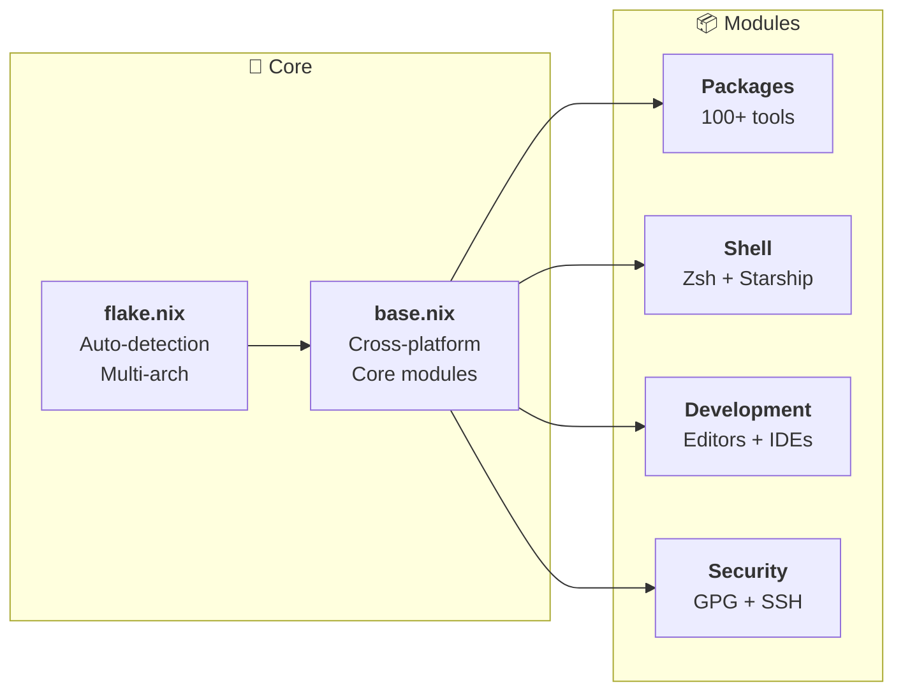

# 🏠 Modular Home-Manager Configuration

A comprehensive, modular [Home-Manager](https://github.com/nix-community/home-manager) configuration for macOS that provides a complete development environment with cross-platform compatibility.

## ✨ Features

### 🚀 Complete Development Stack
- **100+ Essential Packages** - Organized by category (development tools, DevOps, security, productivity)
- **VS Code** with Nix language support and essential extensions
- **Helix Editor** with LSP support for multiple languages
- **Multiple Browsers** - Brave with pre-configured extensions via enterprise policies

### 🔧 Cross-Platform Compatibility
- **Karabiner-Elements** - Linux/Windows-style keybindings on macOS
- **Comprehensive Key Mappings** - Ctrl+C/V/X, navigation keys, volume controls
- **Terminal Integration** - Ghostty with Tokyo Night theme and custom keybindings

### 🛡️ Security & Privacy
- **GPG Configuration** - Enhanced cryptographic settings with YubiKey support
- **SSH Hardening** - Modern ciphers and security policies
- **Browser Privacy** - DuckDuckGo default search, ad blocking, privacy-focused extensions

### 🎨 Beautiful Shell Experience
- **Zsh** with autocompletion, syntax highlighting, and 60+ aliases
- **Starship Prompt** - Multi-language support with Kubernetes, Docker, Git integration
- **Modern CLI Tools** - ripgrep, fd, bat, eza, zoxide, and more

## 📁 Architecture

This configuration uses a **modular, cross-platform approach** with automatic username detection for maximum portability:


```mermaid
graph LR
    subgraph "🔧 Core"
        flake["`**flake.nix**
        Auto-detection
        Multi-arch`"]
        base["`**base.nix**
        Cross-platform
        Core modules`"]
    end
    
    subgraph "📦 Modules"
        packages["`**Packages**
        100+ tools`"]
        shell["`**Shell**
        Zsh + Starship`"]
        dev["`**Development**
        Editors + IDEs`"]
        security["`**Security**
        GPG + SSH`"]
    end
    
    flake --> base
    base --> packages
    base --> shell
    base --> dev
    base --> security
```

### 🏗️ **Key Features**
- **🤖 Automatic Username Detection**: No manual configuration needed
- **🌐 Multi-Architecture**: Apple Silicon, Intel Mac, Linux x64/ARM
- **📦 Modular Design**: 100+ packages across focused modules  
- **🔒 Security-First**: Hardened GPG, SSH, and browser configs
- **🔄 Zero-Config Setup**: Clone and run with `--impure` flag

> 📖 **Detailed Architecture**: See [ARCHITECTURE.md](./ARCHITECTURE.md) for comprehensive diagrams and technical details

## 🚀 Quick Start

### Prerequisites
- **Universal Compatibility**: Works on any supported architecture
- [Nix](https://nixos.org/download.html) installed with flakes enabled
- [Home-Manager](https://github.com/nix-community/home-manager) as a flake

### Installation

1. **Clone this repository:**
   ```bash
   git clone https://github.com/pampatzoglou/home-manager.git ~/.config/home-manager
   cd ~/.config/home-manager
   ```

2. **Apply the configuration:**
   
   **For macOS users (Apple Silicon - recommended):**
   ```bash
   # Full Mac setup with Karabiner-Elements
   home-manager switch --flake '.#mac' --impure
   ```
   
   **For Intel Mac users:**
   ```bash
   home-manager switch --flake '.#mac-intel' --impure
   ```
   
   **For cross-platform/base setup:**
   ```bash
   # Base configuration (Apple Silicon Mac or auto-detect)
   home-manager switch --flake '.#base' --impure
   
   # Other architectures
   home-manager switch --flake '.#base-intel' --impure     # Intel Mac
   home-manager switch --flake '.#base-linux' --impure     # Linux x86_64
   home-manager switch --flake '.#base-linux-arm' --impure # Linux ARM64
   ```

   > **Note:** The `--impure` flag is required because the configuration automatically detects your username from the environment.

4. **Configure Git (Required):**
   After applying the configuration, set up your Git identity and signing key:
   ```bash
   # Set your name and email
   git config --global user.name "Your Name"
   git config --global user.email "your.email@example.com"
   
   # Set up SSH signing (recommended)
   git config --global user.signingKeyPath "~/.ssh/id_ed25519"
   git config --global commit.gpgsign true
   git config --global gpg.format ssh
   
   # Verify configuration
   git config --global --list | grep user
   ```

5. **Set up Karabiner-Elements (macOS only):**
   - Grant Karabiner-Elements permissions in System Preferences
   - Open Karabiner-Elements → Complex Modifications → Add Rule
   - Enable desired Windows shortcuts from the imported community rule sets
   - Switch between "Default" and "External Keyboard" profiles as needed

## 🎛️ Customization

### Adding Packages
Add new packages to `modules/packages.nix` in the appropriate category:
```nix
# Add to the relevant section
pkgs.your-new-package
```

### Modifying Aliases
Edit shell aliases in `modules/zsh.nix`:
```nix
shellAliases = {
  your-alias = "your-command";
};
```

### Browser Extensions
Modify the extension list in `modules/browsers.nix`:
```nix
ExtensionInstallForcelist = [
  "extension-id-here"  # Find IDs in Chrome Web Store URLs
];
```

### Key Remapping
Customize keyboard shortcuts in `modules/karabiner.nix` using the [Karabiner-Elements documentation](https://karabiner-elements.pqrs.org/docs/).

## 📦 What's Included

### Development Tools
- **Languages**: Go, Python, Rust, Node.js with LSPs
- **Editors**: Helix, VS Code with extensions
- **Version Control**: Git with enhanced configuration
- **DevOps**: Docker, Kubernetes tools, Terraform, Ansible

### Security & Privacy
- **Encryption**: GPG with YubiKey support, enhanced algorithms
- **Network**: SSH hardening, VPN tools
- **Browsers**: Privacy-focused configurations, ad blocking

### Productivity
- **Terminal**: Ghostty with custom theme and keybindings  
- **Shell**: Zsh with modern alternatives (bat, ripgrep, fd, eza)
- **Task Management**: TaskWarrior integration
- **Sync**: Syncthing for file synchronization

### System Integration
- **Clipboard**: Cross-platform copy/paste shortcuts
- **Navigation**: Home/End/Page Up/Down remapping
- **Volume**: Function key volume controls
- **Window Management**: Application switching shortcuts

## 🔧 Module Breakdown

| Module | Purpose | Key Features |
|--------|---------|--------------|
| `packages.nix` | System packages | 100+ tools categorized by function |
| `zsh.nix` | Shell environment | Aliases, functions, history settings |
| `starship.nix` | Prompt design | Multi-language, Git, cloud integration |
| `git.nix` | Version control | Security, aliases, global gitignore |
| `helix.nix` | Text editor | LSP support, language configuration |
| `security.nix` | Security tools | GPG, SSH, direnv with hardening |
| `vscode.nix` | IDE setup | VS Code with Nix extensions |
| `browsers.nix` | Web browsing | Brave with managed extensions |
| `ghostty.nix` | Terminal | Theme, fonts, keybindings |
| `karabiner.nix` | Input remapping | Cross-platform key compatibility |
| `kubernetes.nix` | K8s tools | Kubectl plugins, krew automation |

## 🤝 Contributing

1. Fork the repository
2. Create a feature branch
3. Make your changes
4. Test with `home-manager switch --flake .`
5. Submit a pull request

## 📝 License

This configuration is provided as-is for educational and personal use. Feel free to adapt it to your needs.

## 🙏 Acknowledgments

- [Home-Manager](https://github.com/nix-community/home-manager) team
- [Nix](https://nixos.org/) community
- All the amazing tool developers whose packages are included

---

**⚡ Quick Commands:**
```bash
# Apply changes (requires --impure for username detection)
home-manager switch --flake . --impure

# Check for issues
nix flake check

# Update packages
nix flake update

# Rollback changes
home-manager generations
home-manager switch --flake . --switch-generation <id>
