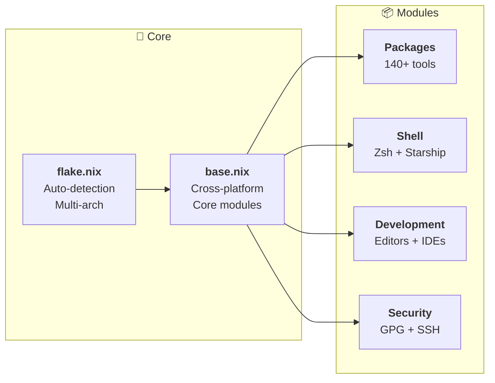

# 🏠 Modular Home-Manager Configuration

[](https://github.com/pampatzoglou/home-manager/actions/workflows/default.yaml)

A comprehensive, modular [Home Manager](https://github.com/nix-community/home-manager) configuration that provides a complete, cross-platform development environment.
This project is a reboot of the original [workstation provisioning](https://github.com/pampatzoglou/provision-workstation).

## ✨ Features

### 🚀 Complete Development Stack

- **147 Essential Packages** - Organized in modular categories (development, DevOps, security, productivity)
- **Helix & Zed Editors** with LSP support for multiple languages
- **Modern Development Tools** - Language servers, formatters, and essential dev utilities
- **Brave Browser** - Privacy-focused web browsing

### 🔧 Cross-Platform Compatibility

- **Multi-Platform Support** - Apple Silicon, Intel Mac, Linux x64/ARM
- **Automatic Username Detection** - Zero-config setup across systems
- **Terminal Integration** - Kitty with custom theme and keybindings
- **Automatic Garbage Collection** - Weekly cleanup of old generations (7-day retention)

### 🎨 Beautiful Shell Experience

- **Zsh** with autocompletion, syntax highlighting, and 60+ aliases
- **Starship Prompt** - Multi-language support with Kubernetes, Docker, Git integration
- **Modern CLI Tools** - ripgrep, fd, bat, eza, zoxide, and more

### 🤖 AI Assistant Configuration

- **Claude Skills** - Auto-discovered reusable skills for common development tasks
- **Personal Preferences** - Coding style, language preferences, and workflows
- **Methodology-Focused** - General best practices for Terraform, Kubernetes, Infrastructure
- **Git-Managed** - All AI configurations version-controlled and reproducible

## 📁 Architecture

This configuration uses a **modular, cross-platform approach** with automatic username detection for maximum portability:


```mermaid
graph LR
    subgraph "🔧 Core"
        flake["`**flake.nix**
        Auto-detection
        Multi-arch`"]
        base["`**base.nix**
        Cross-platform
        Core modules`"]
    end

    subgraph "📦 Modules"
        packages["`**Packages**
        140+ tools`"]
        shell["`**Shell**
        Zsh + Starship`"]
        dev["`**Development**
        Editors + IDEs`"]
        security["`**Security**
        GPG + SSH`"]
    end

    flake --> base
    base --> packages
    base --> shell
    base --> dev
    base --> security
```

### 🏗️ **Key Features**

- **🌐 Multi-Architecture**: Apple Silicon, Intel Mac, Linux x64/ARM
- **📦 Modular Design**: 147 packages across focused modules
- **🔄 Zero-Config Setup**: Clone and run with `--impure` flag

> 📖 **Detailed Architecture**: See [ARCHITECTURE.md](./docs/ARCHITECTURE.md) for comprehensive diagrams and technical details
> 🛠️ **Tools Reference**: See [TOOLS.md](./docs/TOOLS.md) for complete tool documentation and usage examples
> 📋 **Task Automation**: See [TASKS.md](./docs/TASKS.md) for common tasks and automation workflows
> 🤖 **AI Assistant Setup**: See [agentic/README.md](./agentic/README.md) for Claude configuration and skills

## 🚀 Quick Start

> ⚠️ **Important:** This flake uses automatic username detection via `builtins.getEnv "USER"`, which requires the `--impure` flag for all `home-manager` commands.
> 
> **Recommended:** `home-manager switch -b backup --impure` (creates backups)  
> **Alternative:** `home-manager switch --flake . --impure` (no backups)

### Prerequisites

- **Universal Compatibility**: Works on any supported architecture
- [Nix](https://nixos.org/download.html) installed with flakes enabled
- [Home-Manager](https://github.com/nix-community/home-manager) as a flake

   ```bash
   git clone https://github.com/pampatzoglou/home-manager.git ~/.config/home-manager
   sh <(curl --proto '=https' --tlsv1.2 -L https://nixos.org/nix/install)
   ```

- **Mac specific**: `xcodebuild needs` the full Xcode app (not just the CLI tools). Two options:

1. Install full Xcode (recommended)
2. Install from the App Store, then run:

   ```bash
   sudo xcode-select -s /Applications/Xcode.app/Contents/Developer
   sudo xcodebuild -license accept
   ```

### Installation

Experimental Features: nix-command (and optionally flakes) must be enabled for Home-Manager commands to work.

#### Option 1: Temporary Enablement (Quick Start)

For a one-time installation without modifying system configuration:

```bash
nix-shell -p home-manager --extra-experimental-features 'nix-command flakes' --run "home-manager switch -b backup --impure"
```

---

#### Option 2: Permanent Enablement (Recommended)

Add the following to `~/.config/nix/nix.conf` (single-user) or `/etc/nix/nix.conf` (system-wide):

```nix
experimental-features = nix-command flakes
```

Then run the installation:

```bash
nix-shell -p home-manager --run "home-manager switch -b backup --impure"
```

### 🎛️ Customization

### Adding Packages

Add new packages to `modules/packages.nix` in the appropriate category:

```nix
# Add to the relevant section
pkgs.your-new-package
```

### Modifying Aliases

Edit shell aliases in `modules/zsh.nix`:

```nix
shellAliases = {
  your-alias = "your-command";
};
```

## 📦 What's Included

### Development Tools

- **Languages**: Go, Python, Rust with LSPs and formatters
- **Editors**: Helix and Zed with comprehensive language support, format-on-save
- **Version Control**: Git with enhanced configuration
- **DevOps**: Kubernetes tools, Terraform, Ansible, Cloud CLIs

### Productivity

- **Terminal**: Kitty with custom theme and keybindings
- **Shell**: Zsh with modern alternatives (bat, ripgrep, fd, eza)
- **Sync**: Syncthing for file synchronization

### Infrastructure & Cloud

- **Kubernetes**: kubectl, helm, k9s, lens, argocd, etc...
- **Cloud Providers**: AWS CLI, Azure CLI, Hcloud
- **Infrastructure as Code**: Terraform, OpenTofu, Pulumi, etc...
- **Container Tools**: Docker ecosystem, Skaffold, Kind, etc...

## 🔧 Module Breakdown

This configuration consists of **11 active modules**:

| Module | Purpose | Key Features |
|--------|---------|--------------|
| `packages.nix` | Package orchestration | Imports 7 category-specific package modules (147 total packages) |
| `packages/core.nix` | Core utilities | System tools, modern CLI replacements |
| `packages/development.nix` | Development tools | Editors, LSPs, formatters, testing tools |
| `packages/kubernetes.nix` | Kubernetes ecosystem | kubectl, helm, k9s, and 20+ K8s tools |
| `packages/infrastructure.nix` | Infrastructure as Code | Terraform, Pulumi, Ansible, cloud CLIs |
| `packages/security.nix` | Security & secrets | Trivy, Vault, GPG, compliance tools |
| `packages/observability.nix` | Monitoring & data | Grafana, PostgreSQL, Kafka tools |
| `packages/productivity.nix` | Daily tools | Terminal, browser, Git workflow |
| `zsh.nix` | Shell environment | Aliases, functions, history settings |
| `starship.nix` | Prompt design | Multi-language, Git, cloud integration |
| `git.nix` | Version control | Security, aliases, global gitignore |
| `helix.nix` | Text editor | LSP support, SRE language configuration |
| `zed.nix` | Modern editor | LSP, format-on-save, Solarized Dark theme |
| `security.nix` | Security configs | GPG, SSH, direnv with hardening |
| `kitty.nix` | Terminal | Solarized Dark theme, fonts, keybindings |
| `kubernetes.nix` | K8s configuration | Kubectl plugins, krew automation |
| `claude.nix` | AI assistant config | Auto-discovered skills, personal preferences |
| `gc.nix` | Garbage collection | Automatic cleanup of old generations |

## 📝 License

This configuration is provided as-is for educational and personal use. Feel free to adapt it to your needs.

## 🙏 Acknowledgments

- [Home-Manager](https://github.com/nix-community/home-manager) team
- [Nix](https://nixos.org/) community
- All the amazing tool developers whose packages are included

## 🤖 AI Assistant Configuration

This configuration includes a comprehensive setup for Claude AI Assistant with auto-discovered skills and personal preferences.

### Structure

```
agentic/claude/
├── CLAUDE.md                 # Personal coding preferences
├── settings.json.template    # Permission rules template
└── skills/                   # Auto-discovered skills
    ├── code-review.md
    ├── debugging.md
    ├── infrastructure.md
    ├── kubernetes.md
    └── terraform.md
```

### Adding New Skills

Skills are **automatically discovered** - no module editing required:

```bash
# 1. Create skill file
vim agentic/claude/skills/my-skill.md

# 2. Stage in git (required for Nix flakes)
git add agentic/claude/skills/my-skill.md

# 3. Deploy (--impure required!)
home-manager switch -b backup --impure  # With backups (recommended)
# OR
home-manager switch --flake . --impure  # Without backups
```

### Available Skills

- **code-review.md** - Security, quality, performance checklists
- **debugging.md** - Systematic 6-step debugging methodology
- **infrastructure.md** - DevOps, monitoring, CI/CD best practices
- **kubernetes.md** - Platform-aware resource management patterns
- **terraform.md** - General IaC methodology and best practices

For detailed documentation, see [agentic/README.md](./agentic/README.md).

---

**⚡ Quick Commands:**

```bash
# Check for issues
nix flake check

# Update packages
nix flake update

# Apply changes (--impure required!)
home-manager switch -b backup --impure  # With backups (recommended)
# OR
home-manager switch --flake . --impure  # Without backups

# Rollback changes
home-manager generations
home-manager switch --switch-generation <id>
```

> 💡 **Remember:** All `home-manager switch` commands require `--impure` due to auto-detection of username.  
> 💡 **Tip:** Use `-b backup` to create backups of existing files before replacing them.

# 📝 DEVELOPER IDENTIFICATION
Customizations are stored in the [DEVELOPER IDENTITY](./docs/DEVELOPER_IDENTITY.md).

---

## 🗑️ Cleanup & Maintenance

### ♻️ Automatic Garbage Collection

This configuration automatically cleans up old Home-Manager generations to save disk space:

- **Frequency**: Weekly (configurable in `modules/gc.nix`)
- **Retention**: Keeps generations for 7 days
- **Manual Trigger**: Run `nix-collect-garbage --delete-older-than 7d`

**Customize retention period** by editing `modules/gc.nix`:
```nix
nix.gc = {
  automatic = true;
  dates = "daily";  # Options: "daily", "weekly", "monthly"
  options = "--delete-older-than 14d";  # Change to 14 days, 30d, etc.
};
```

### 🍎 macOS Users

If you experience issues after macOS system updates (broken `nix-shell`, daemon errors, SDK problems), see the [macOS Recovery Guide](./docs/MACOS_RECOVERY.md) for comprehensive troubleshooting steps.

### 🗑️ Complete Removal

For instructions on removing nix and resetting your system, see [PURGE.md](./docs/PURGE.md).
