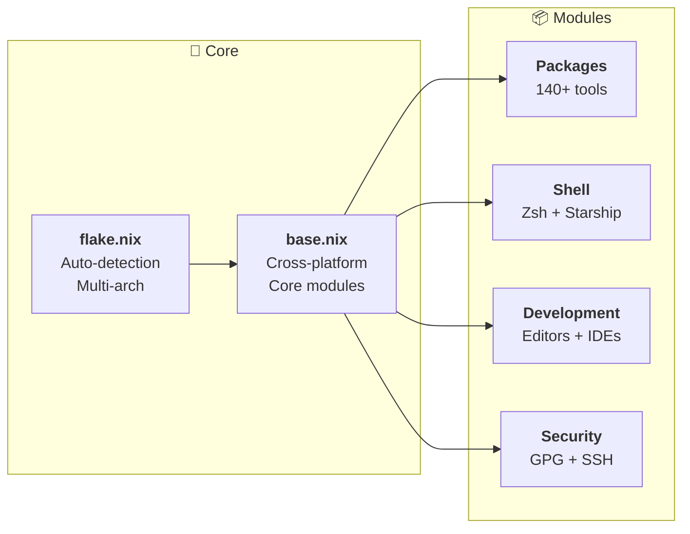

# 🏠 Modular Home-Manager Configuration

A comprehensive, modular [Home Manager](https://github.com/nix-community/home-manager) configuration that provides a complete, cross-platform development environment.
This project is a reboot of the original [workstation provisioning](https://github.com/pampatzoglou/provision-workstation).


## ✨ Features

### 🚀 Complete Development Stack
- **140+ Essential Packages** - Organized by category (development tools, DevOps, security, productivity)
- **Helix Editor** with LSP support for multiple languages
- **Modern Development Tools** - Language servers, formatters, and essential dev utilities
- **Brave Browser** - Privacy-focused web browsing

### 🔧 Cross-Platform Compatibility
- **Multi-Platform Support** - Apple Silicon, Intel Mac, Linux x64/ARM
- **Automatic Username Detection** - Zero-config setup across systems
- **Terminal Integration** - Ghostty with custom theme and keybindings

### 🛡️ Security & Privacy
- **GPG Configuration** - Enhanced cryptographic settings with YubiKey support
- **SSH Hardening** - Modern ciphers and security policies
- **Browser Privacy** - DuckDuckGo default search, ad blocking, privacy-focused extensions

### 🎨 Beautiful Shell Experience
- **Zsh** with autocompletion, syntax highlighting, and 60+ aliases
- **Starship Prompt** - Multi-language support with Kubernetes, Docker, Git integration
- **Modern CLI Tools** - ripgrep, fd, bat, eza, zoxide, and more

## 📁 Architecture

This configuration uses a **modular, cross-platform approach** with automatic username detection for maximum portability:


```mermaid
graph LR
    subgraph "🔧 Core"
        flake["`**flake.nix**
        Auto-detection
        Multi-arch`"]
        base["`**base.nix**
        Cross-platform
        Core modules`"]
    end
    
    subgraph "📦 Modules"
        packages["`**Packages**
        140+ tools`"]
        shell["`**Shell**
        Zsh + Starship`"]
        dev["`**Development**
        Editors + IDEs`"]
        security["`**Security**
        GPG + SSH`"]
    end
    
    flake --> base
    base --> packages
    base --> shell
    base --> dev
    base --> security
```

### 🏗️ **Key Features**
- **🤖 Automatic Username Detection**: No manual configuration needed
- **🌐 Multi-Architecture**: Apple Silicon, Intel Mac, Linux x64/ARM
- **📦 Modular Design**: 140+ packages across focused modules  
- **🔒 Security-First**: Hardened GPG, SSH, and browser configs
- **🔄 Zero-Config Setup**: Clone and run with `--impure` flag

> 📖 **Detailed Architecture**: See [ARCHITECTURE.md](./ARCHITECTURE.md) for comprehensive diagrams and technical details

## 🚀 Quick Start

### Prerequisites
- **Universal Compatibility**: Works on any supported architecture
- [Nix](https://nixos.org/download.html) installed with flakes enabled
- [Home-Manager](https://github.com/nix-community/home-manager) as a flake

   ```bash
   git clone https://github.com/pampatzoglou/home-manager.git ~/.config/home-manager
   sh <(curl --proto '=https' --tlsv1.2 -L https://nixos.org/nix/install)
   ```

### Installation

   ```bash
   nix-shell -p home-manager --run "home-manager switch -b backup --impure"
   ```

### 🎛️ Customization

**Configure Git:**
   After applying the configuration, set up your Git identity and signing key:
   ```bash
   # Set your name and email
   sudo git config --global user.name "Your Name"
   sudo git config --global user.email "your.email@example.com"
   
   # Set up SSH signing (recommended)
   sudo git config --global user.signingKeyPath "~/.ssh/id_ed25519"
   sudo git config --global commit.gpgsign true
   sudo git config --global gpg.format ssh
   
   # Verify configuration
   git config --global --list | grep user
   ```

### Adding Packages
Add new packages to `modules/packages.nix` in the appropriate category:
```nix
# Add to the relevant section
pkgs.your-new-package
```

### Modifying Aliases
Edit shell aliases in `modules/zsh.nix`:
```nix
shellAliases = {
  your-alias = "your-command";
};
```

## 📦 What's Included

### Development Tools
- **Languages**: Go, Python, Rust with LSPs and formatters
- **Editors**: Helix with comprehensive language support
- **Version Control**: Git with enhanced configuration
- **DevOps**: Kubernetes tools, Terraform, Ansible, Cloud CLIs

### Security & Privacy
- **Encryption**: GPG with YubiKey support, enhanced algorithms
- **Security Tools**: Trivy, TruffleHog, Gitleaks, Cosign
- **Compliance**: Kube-bench, Kyverno, OPA tools

### Productivity
- **Terminal**: Ghostty with custom theme and keybindings  
- **Shell**: Zsh with modern alternatives (bat, ripgrep, fd, eza)
- **Task Management**: TaskWarrior integration
- **Sync**: Syncthing for file synchronization

### Infrastructure & Cloud
- **Kubernetes**: kubectl, helm, k9s, lens, argocd, etc...
- **Cloud Providers**: AWS CLI, Azure CLI, Hcloud
- **Infrastructure as Code**: Terraform, OpenTofu, Pulumi, etc...
- **Container Tools**: Docker ecosystem, Skaffold, Kind, etc...

## 🔧 Module Breakdown

| Module | Purpose | Key Features |
|--------|---------|--------------|
| `packages.nix` | System packages | 140+ tools categorized by function |
| `zsh.nix` | Shell environment | Aliases, functions, history settings |
| `starship.nix` | Prompt design | Multi-language, Git, cloud integration |
| `git.nix` | Version control | Security, aliases, global gitignore |
| `helix.nix` | Text editor | LSP support, language configuration |
| `security.nix` | Security tools | GPG, SSH, direnv with hardening |
| `ghostty.nix` | Terminal | Theme, fonts, keybindings |
| `kubernetes.nix` | K8s tools | Kubectl plugins, krew automation |

## 📝 License

This configuration is provided as-is for educational and personal use. Feel free to adapt it to your needs.

## 🙏 Acknowledgments

- [Home-Manager](https://github.com/nix-community/home-manager) team
- [Nix](https://nixos.org/) community
- All the amazing tool developers whose packages are included

---

**⚡ Quick Commands:**
```bash
# Check for issues
nix flake check

# Update packages
nix flake update

# Rollback changes
home-manager generations
home-manager switch --flake . --switch-generation <id>
```
