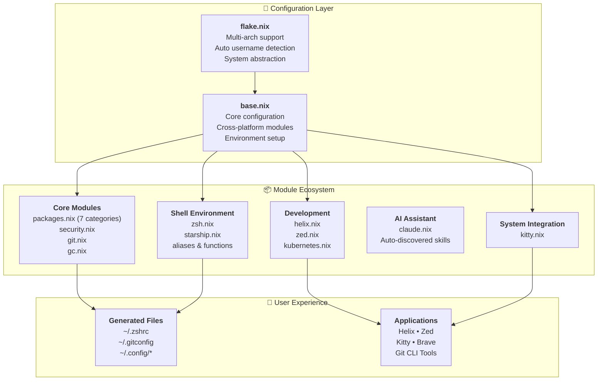
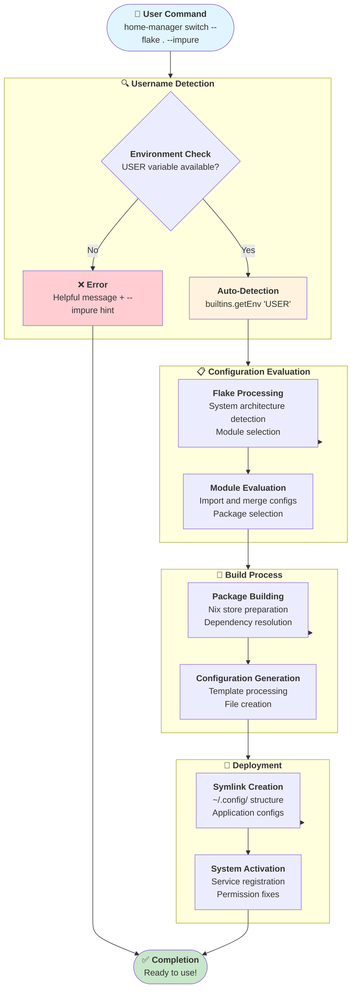
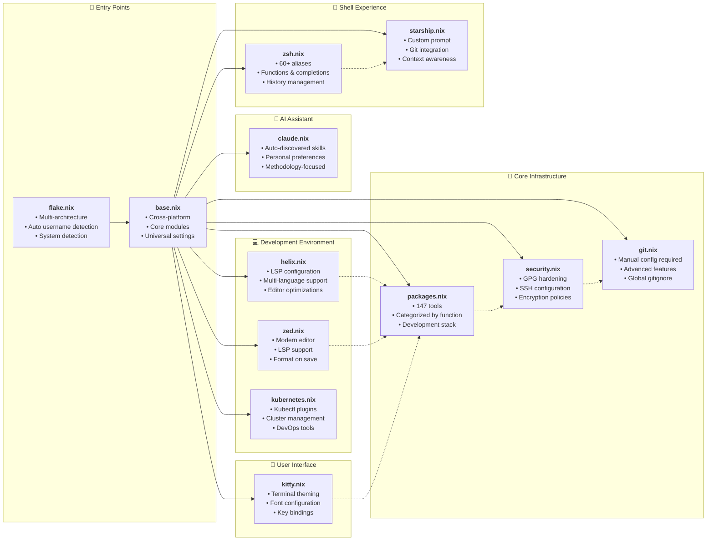
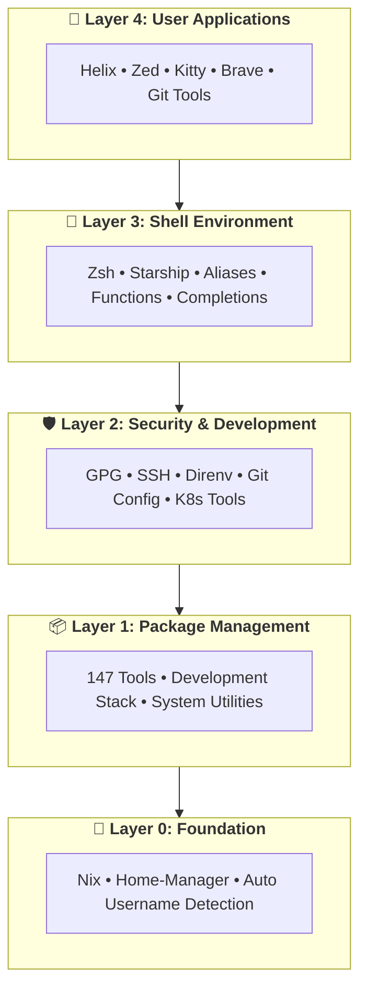
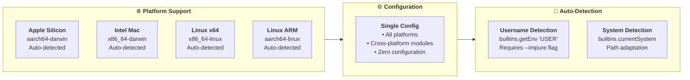
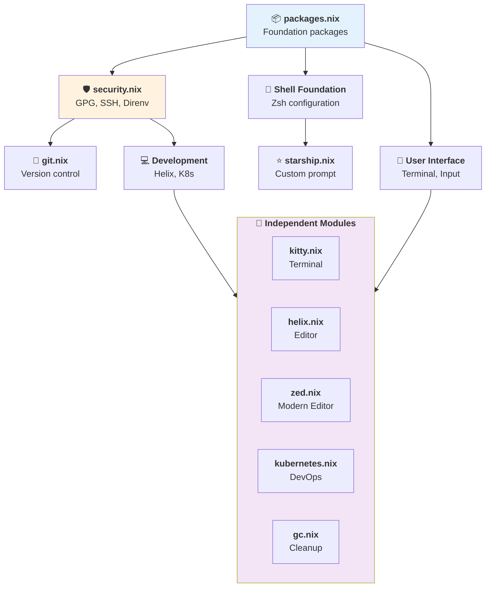

# 🏗️ Home-Manager Configuration Architecture

This document describes the modular architecture of our cross-platform Home-Manager configuration, featuring automatic username detection and complete portability.

## 🎯 System Overview

## 🔄 Configuration Flow

## 📁 Module Architecture

## 🏗️ System Architecture Layers

## 🔀 Configuration Variants

## 🎛️ Module Dependencies

## 🔧 Architecture Benefits

### ✨ **Modularity**

- **Focused Modules**: Each module handles a specific domain
- **Easy Customization**: Enable/disable features independently
- **Clean Separation**: Clear boundaries between components
- **Testing Isolation**: Test modules independently

### 🔄 **Portability**

- **Auto-Detection**: No manual username configuration
- **Cross-Platform**: Works on macOS, Linux (x64, ARM)
- **Zero Config**: Clone and run with minimal setup
- **Reproducible**: Identical environments across machines

### 🚀 **Maintainability**

- **Version Control**: Precise tracking of changes
- **Documentation**: Self-documenting configuration
- **Debugging**: Easy to isolate and fix issues
- **Updates**: Granular package and module updates

### 🏗️ **Scalability**

- **Extensible**: Add modules without affecting existing setup
- **Multi-User**: Easy to fork and customize
- **Multi-System**: Support different architectures seamlessly
- **Future-Proof**: Easy to adapt to new tools and requirements

